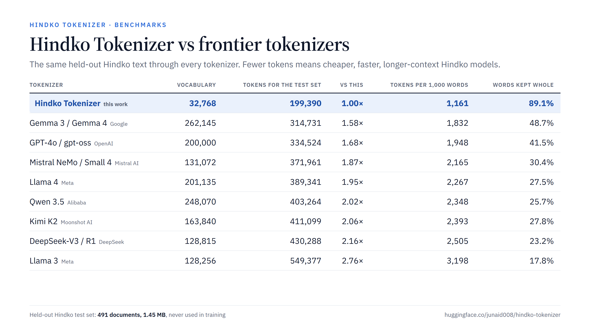

# Hindko Tokenizer

Code and documentation behind **Hindko Tokenizer**, the first tokenizer built for Hindko (ہندکو), the Indo-Aryan language of Peshawar, Hazara and Kohat.

The released tokenizer (SentencePiece Unigram, 32,768 tokens) is on Hugging Face: **[junaid008/hindko-tokenizer](https://huggingface.co/junaid008/hindko-tokenizer)**. This repository holds the pipeline that built the training corpus and the study that trained, selected and evaluated the tokenizer.



## Results

Measured on a held-out Hindko test set (491 documents, 1.45 MB) never used for training or selection:

| | Hindko Tokenizer | GPT-4o | Gemma 3 | Llama 4 | Qwen 3.5 | DeepSeek-V3 |
|---|---:|---:|---:|---:|---:|---:|
| Bytes per token (higher is better) | **7.28** | 4.34 | 4.61 | 3.73 | 3.60 | 3.37 |
| Tokens needed vs Hindko Tokenizer | **1.00×** | 1.68× | 1.58× | 1.95× | 2.02× | 2.16× |
| Words kept as one token | **89.1%** | 41.5% | 48.7% | 27.5% | 25.7% | 23.2% |

- #1 of the 131 tokenizers that reproduce Hindko text exactly, out of 550 public tokenizers measured.
- Lossless: 491 of 491 test documents decode back to the exact input.
- Selected by training small GPT-style language models from scratch with each finalist and comparing held-out bits per byte, under a protocol written before any language-model result existed.

Full results, charts and limitations: [`docs/model_card/README.md`](docs/model_card/README.md).

## Repository layout

| Folder | What it does |
|---|---|
| [`pipeline/`](pipeline) | Corpus pipeline: InPage decoding, OCR, segmentation, cleaning, deduplication, quality gates, PII masking and the dataset build (`pipeline/hp/build.py`). See [`pipeline/README.md`](pipeline/README.md). |
| [`web/`](web) | Web collection: crawling Hindko sites, FineWeb-2 extraction, Wayback recovery and the language-ID classifier that separates Hindko from Urdu, Punjabi, Saraiki and Pashto. |
| [`tokenizer/research/`](tokenizer/research) | The pre-registered study plan ([`PLAN.md`](tokenizer/research/PLAN.md)) and the literature review ([`SOTA_TOKENIZATION.md`](tokenizer/research/SOTA_TOKENIZATION.md)). |
| [`tokenizer/splits/`](tokenizer/splits), [`tokenizer/data/`](tokenizer/data) | Group-disjoint train/dev/test splits (whole newspaper editions, books and web sites per side) and the training views. |
| [`tokenizer/normalization/`](tokenizer/normalization) | The canonical text normalization (`hp.normalize`) and its regression tests. |
| [`tokenizer/candidates/`](tokenizer/candidates) | The 75 candidate builds: BPE, SentencePiece BPE and Unigram, and reimplementations of SuperBPE, PickyBPE and MinGram. |
| [`tokenizer/eval/`](tokenizer/eval), [`tokenizer/baselines/`](tokenizer/baselines) | The intrinsic evaluation harness (bytes per token, fertility, round-trip gates) and the external baselines. |
| [`tokenizer/lm/`](tokenizer/lm), [`tokenizer/colab/`](tokenizer/colab) | The language-model arbiter (`hk_lm.py`) and the Colab runners used to train the small models. |
| [`tokenizer/analysis/`](tokenizer/analysis) | Statistics and the decision: [`DECISION.md`](tokenizer/analysis/DECISION.md), [`AMENDMENT_1.md`](tokenizer/analysis/AMENDMENT_1.md), [`TEST_RESULTS.md`](tokenizer/analysis/TEST_RESULTS.md). |
| [`tokenizer/release_build/`](tokenizer/release_build) | Building and verifying the released `tokenizer.json`. |
| [`tokenizer/sota/`](tokenizer/sota) | The comparison against 550 public tokenizers, robustness tests and the vocabulary audit. |
| [`tokenizer/trackb/`](tokenizer/trackb) | Hindko vocabulary extensions for existing LLM tokenizers (Llama, Qwen, Gemma). |
| [`tokenizer/morphology/`](tokenizer/morphology) | Morphology evaluation (report-only). |
| [`docs/`](docs) | The model card with benchmark charts, and the release technical card. |

## What is not in this repository

- **The corpus and any data files.** The Hindko texts belong to their publishers and authors and are not redistributed here.
- **The trained tokenizer files.** Download them from [Hugging Face](https://huggingface.co/junaid008/hindko-tokenizer).
- **Third-party tokenizers and code.** The baselines are downloaded by `tokenizer/baselines/scripts`. The InPage glyph table `glyph_map.py` (GPL-3.0) is fetched separately; see [`pipeline/README.md`](pipeline/README.md).

## Use the tokenizer

```python
from transformers import AutoTokenizer

tok = AutoTokenizer.from_pretrained("junaid008/hindko-tokenizer")
ids = tok("ایہہ بہت کہٹ لوک جانڑدین کہ ڈرامے دی پیدائش کسراں تے کتھے ہوئی آئی۔")["input_ids"]   # 14 tokens
```

## Requirements

Python 3.11. The main packages are `sentencepiece` (0.2.1), `tokenizers`, `transformers`, `numpy` and, for the language-model arbiter, `torch` (run on Google Colab GPUs).

## Authors

Junaid Aslam ([junaid008](https://huggingface.co/junaid008)) and Muhammad Ozair.
